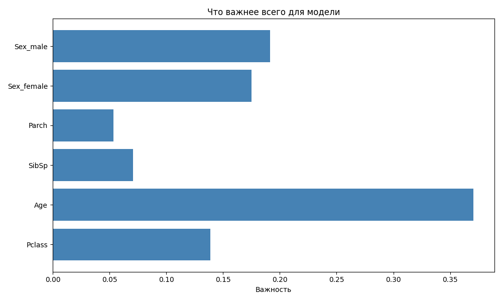

# Titanic Survival Prediction

Предсказание выживания пассажиров Титаника с использованием алгоритма **Random Forest**.

##  Описание проекта

Это классическая задача машинного обучения.  
На основе данных о пассажирах (пол, возраст, класс билета и т.д.) модель предсказывает, выжил человек или нет.

##  Результаты

| Метрика | Значение |
|---------|----------|
| **Точность (Accuracy)** | 81% |
| **Лучшая модель** | Random Forest (100 деревьев) |

## 🔍 Самые важные признаки

Модель показала, что на выживание больше всего влияют:

1. **Пол** (Sex) — женщины выживали чаще
2. **Класс** (Pclass) — первый класс безопаснее
3. **Возраст** (Age) — дети выживали чаще

